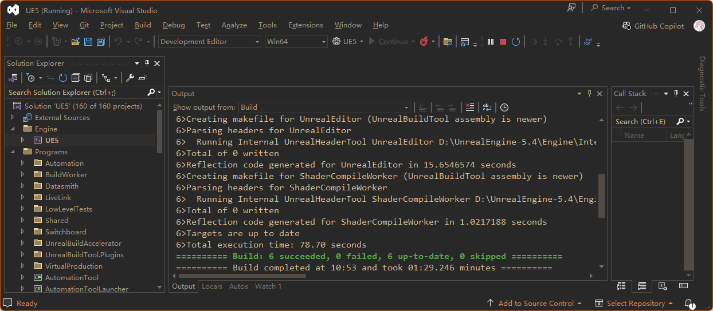
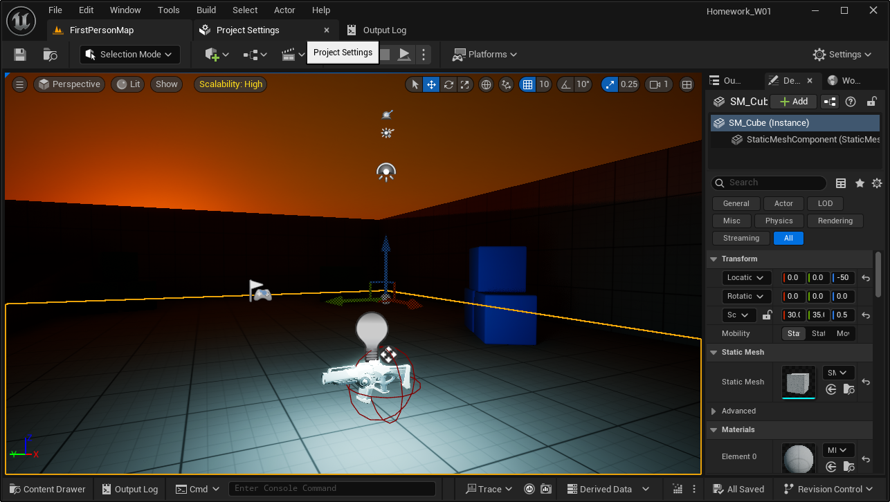
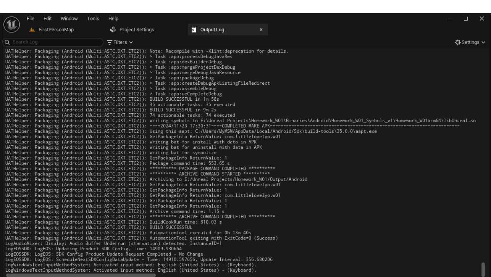
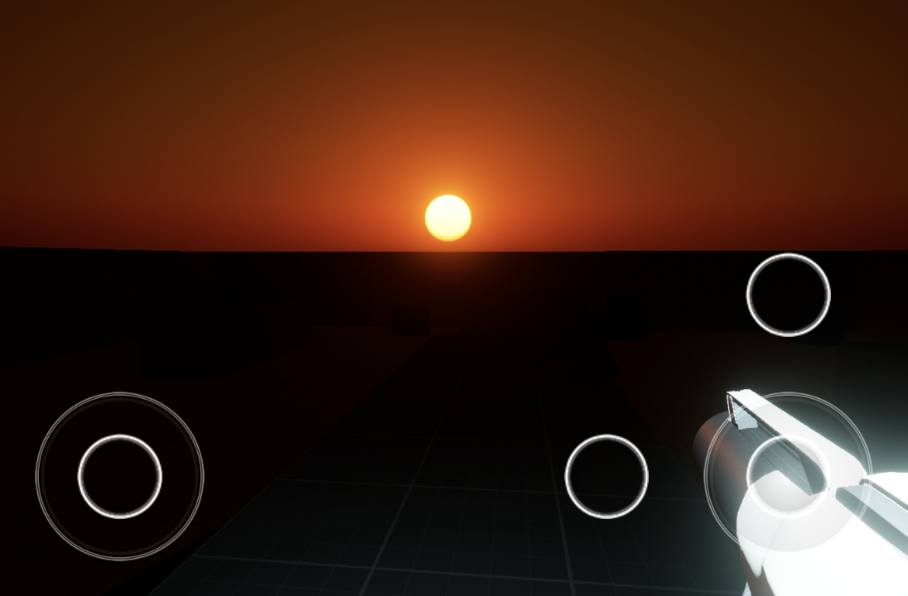

# Homework-W01
## 作业
1. 源码编译UE5，新建一个C++工程，进行简单场景编辑和工程设置；
2. 编译并构建安装包，确保能够用来将游戏工程安装到手机正常运行（若无Andorid手机可构建桌面版本）。
## 实现步骤
1. 下载源码，按照官方文档的说明编译并运行引擎。编译的引擎版本为Unreal Engine 5.4.4。\
\
由于电脑配置的限制，从源码构建引擎的时间太长，为避免可能遇到的问题，之后使用Epic Games Launcher里的Unreal Engine 5.5.0。
2. 从第一人称射击模版新建C++工程，并进行简单的工程设置和场景编辑。\
具体地，在工程设置里关闭了Lumen全局光照和反射；在场景中隐藏了体积云，修改了光源角度和天空颜色，在枪上增加了点光源。\

3. 安装Android SDK并打包。\

4. 将生成的APK安装包安装到移动设备上并运行，效果如下图。运行设备：HUAWEI MatePad Air DBY2-W00；操作系统：Harmony OS 4.2.0。\

